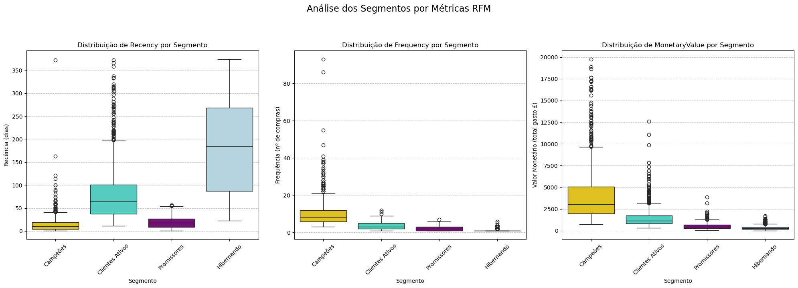
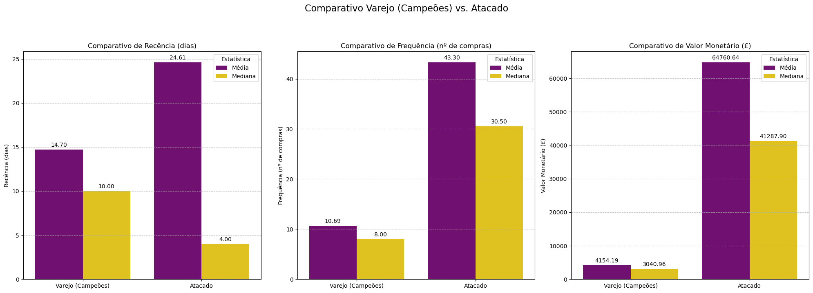

# **Segmentação de clientes com K-means**

## Visão Geral do Projeto
- **Objetivo principal**: Segmentar a base de clientes de uma loja de varejo online para identificar diferentes perfis de comportamento de compra, permitindo a criação de estratégias de marketing e de negócio personalizadas.
- **Escopo**: O projeto abrange desde a limpeza e o pré-processamento de um ano de dados transacionais até a engenharia de features (Análise RFM), a aplicação de modelagem não supervisionada (K-Means) e a interpretação e recomendação de ações com base nos segmentos encontrados.
- **Principais perguntas de negócio**:
  * Quais são os principais perfis de clientes da nossa base de dados?
  * Existem clientes com alto risco de perda (churn) que necessitam de atenção imediata?
  * Como podemos personalizar as ações de marketing para aumentar o engajamento e a retenção?

## Tecnologias Utilizadas
- **Linguagem de Programação**: Python 3.12.7
- **Bibliotecas de Análise de Dados**: Pandas, NumPy
- **Bibliotecas de Visualização**: Matplotlib, Seaborn
- **Bibliotecas de Machine Learning**: Scikit-learn
- **Ambiente de Desenvolvimento**: Jupyter Notebook

## Como Executar o Projeto
1. Clone o repositório: `git clone https://github.com/seu-usuario/nome-do-repositorio.git`
2. Navegue até o diretório do projeto: `cd nome-do-repositorio`
3. Instale as dependências: `pip install -r requirements.txt`
4. Abra o notebook principal: `jupyter notebook notebooks/segmentacao_clientes.ipynb`

## Estrutura do Repositório
```
/
├── data/        # Contém o dataset bruto (Online Retail.xlsx)
├── assets/      # Gráficos para o arquivo README
├── notebook/    # Notebook Jupyter com a análise completa
└── README.md
```


## Compreensão dos Dados
### Origem
- Os dados foram obtidos do **Online Retail Dataset**, disponível no [Repositório de Machine Learning da UCI](https://archive.ics.uci.edu/dataset/352/online+retail). O conjunto de dados contém transações ocorridas entre 01/12/2010 e 09/12/2011.

### Estrutura e Limpeza
- **Colunas relevantes**: `InvoiceNo`, `StockCode`, `Description`, `Quantity`, `InvoiceDate`, `UnitPrice`, `CustomerID`, `Country`.
- **Processo de Limpeza**: Um rigoroso processo de limpeza foi aplicado para garantir a qualidade dos dados para a análise, incluindo:
```
  • Remoção de 25% das transações que não possuíam `CustomerID`, pois eram inutilizáveis para a segmentação de clientes.
  • Exclusão de transações com quantidade negativa, que correspondiam a cancelamentos.
  • Correção de tipos de dados, como a conversão de datas e preços para formatos numéricos adequados.
  • Remoção de entradas que não eram produtos, mas sim taxas de serviço (ex: 'POST', 'M').
  • Padronização de nomes de países para ter melhor consistência.
```
- **Engenharia de Features**: A análise RFM foi a principal técnica de engenharia de features. Para cada cliente, foram criadas as seguintes métricas:
```
  • `Recency`: Dias desde a última compra.
  • `Frequency`: Número total de transações (faturas) distintas.
  • `MonetaryValue`: Soma total do valor gasto.
```

### Limitações
- Os dados se referem a um período de apenas um ano, o que limita análises de tendências de longo prazo.
- A perda de 25% dos dados devido a `CustomerID`s ausentes pode introduzir um viés se esses clientes tiverem um perfil de compra diferente dos clientes registrados.

## Análise
### Tópico de Análise 1: Segmentação do Varejo com K-Means
Após a separação estratégica do segmento de atacado, o algoritmo K-Means foi aplicado na base de varejo. A combinação do Método do Cotovelo e da Análise de Silhueta indicou K=4 como o número ideal de clusters. Principais descobertas:
  - **Campeões (827 clientes):** A elite do varejo, com altíssima frequência e valor. Perfil: R=15, F=11, M=£4,154.
  - **Clientes Ativos (1.165 clientes):** A base sólida do negócio, com bom valor, mas precisando de estímulos. Perfil: R=81, F=4, M=£1,479.
  - **Promissores (819 clientes):** Clientes novos ou recentes com alto potencial de crescimento. Perfil: R=19, F=2, M=£512.
  - **Hibernando (1.478 clientes):** O maior grupo, composto por clientes inativos e com alto risco de perda. Perfil: R=188, F=1, M=£308.



### Tópico de Análise 2: Análise do Segmento de Atacado
Uma análise descritiva foi realizada nos 44 clientes de atacado. Destaques:
  - **Impacto Estratégico:** Este 1% da base de clientes é responsável por **32% do faturamento total** da empresa.
  - **Modelo de Distribuição:** O padrão de 1-2 clientes por país internacional sugere um modelo de negócio B2B com parceiros de distribuição exclusivos.
  - **Padrões de Compra:** Não há um padrão único; existem clientes **"Especialistas"** (alto volume de poucos produtos) e **"Generalistas"** (ampla variedade de itens).
  - **Risco Financeiro:** Foi identificado que **9,26%** da receita do atacado está em risco devido à inatividade de apenas 5 clientes.



## Conclusão
- **Resultados-chave**: O projeto validou que a base de clientes é composta por dois mundos distintos, Varejo e Atacado, cada um com seus próprios padrões e necessidades. No varejo, foram identificados 4 segmentos acionáveis. No atacado, foi revelado um pequeno grupo de clientes de altíssimo impacto, operando como parceiros estratégicos.
- **Fatores de influência**: As métricas RFM foram drivers eficazes para a segmentação. A decisão metodológica de separar os dados de varejo e atacado foi crucial para a obtenção de insights claros e não distorcidos.
- **Lições aprendidas**:

  * A qualidade dos dados é fundamental; a ausência de IDs de cliente pode levar a perdas significativas de informação.
  * A interpretação de negócio deve sobrepor a otimização puramente matemática (ex: escolher K=4 em vez de K=2 para maior granularidade).
  * Outliers nem sempre são erros; podem representar um segmento de negócio inteiramente novo e valioso.

<blank>

- **Recomendações para análises futuras**:

  * **Curto Prazo:** Implementar um dashboard interativo para monitorar a evolução dos segmentos de varejo em tempo real.
  * **Médio Prazo:** Aprofundar a análise da cesta de compras para entender os perfis "Especialista vs. Generalista" e personalizar as recomendações.
  * **Longo Prazo:** Evoluir da análise descritiva para a preditiva, construindo modelos de previsão de churn e de Valor do Cliente (CLV).

## Autor
- **Eduardo garcia Reis**
- **LinkedIn**: [linkedin.com/in/eduardoreis](http://www.linkedin.com/in/eduardo-reis-a4609b278)
- **Portfólio**: [github.com/eduardogr-dados](https://github.com/eduardogr-dados?tab=repositories)

## Licença
Este projeto está sob a licença MIT.
